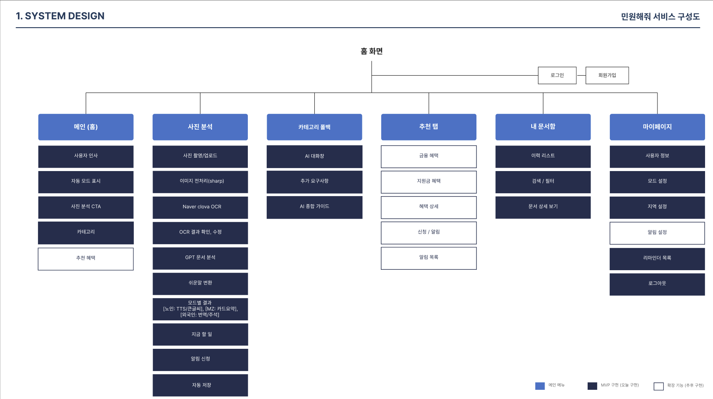
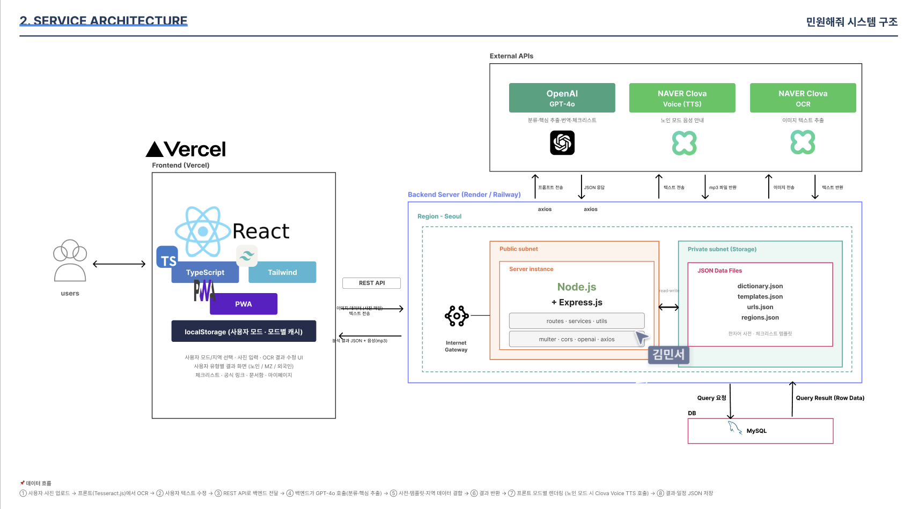
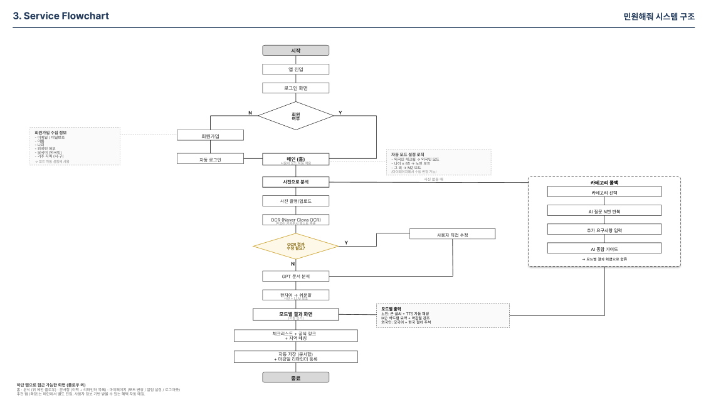

# 민원해줘

공공문서를 사진 한 장으로 분석하여 정보 취약 사용자가 행정 절차를 이해하고 행동까지 이어갈 수 있도록 돕는 AI 행정 도우미.

[-d32f2f?style=for-the-badge)](#)

---

## 한 줄 소개

행정용어가 많아 이해하기 어려운 공공문서를 AI가 쉬운 말로 풀어주고, "지금 할 일"을 체크리스트와 공식 링크로 안내하여 정보 취약 사용자가 자기 행정을 스스로 챙길 수 있도록 돕는 서비스.

동양미래대학교 2026 1학기 솜커톤 · 대상(1등) · 2026.05.14

상장 실물 보기 <em>(추후 추가 예정)</em>

 

추후 추가 예정.

---

## 데모

- 발표 자료 (PDF): [민원해줘_발표PPT_통합.pdf](민원해줘_발표PPT_통합.pdf)
- 앱 디자인 (PDF): [민원해줘_앱디자인_통합.pdf](민원해줘_앱디자인_통합.pdf)

---

## 문제 정의

정보 취약 사용자가 행정문서를 이해하고 행동까지 이어가기 어렵다.

- 노년층 디지털 정보화 수준은 전 국민의 71.4%, 정보 취약계층 디지털 역량은 65.6% (NIA 디지털정보격차 실태조사, 2024)
- 국내 외국인 283만 명, 인구의 5.5%로 증가 추세 (법무부 출입국 통계월보, 2025.10)
- 시민 61.8%가 "공공언어를 바꿔야 한다"고 응답 (문화체육관광부·국립국어원, 2025)

행정문서는 한자어와 행정용어가 많아 즉시 이해하기 어렵고, 뜻을 이해해도 "어디서·언제까지·무엇을" 해야 하는지를 다시 찾아야 한다.

---

## 솔루션

세 가지 핵심 기능과 사용자 유형별 자동 모드 적용으로 "이해와 행동 사이의 빈칸"을 채운다.

| 기능 | 설명 |
|---|---|
| 찍어서 읽기 | 공공문서 사진을 네이버 클로바 OCR로 추출. 금액·날짜는 OCR 원문 직접 추출만 사용하여 환각 방지 |
| 쉽게 풀기 + 내게 맞게 보기 | GPT-4o가 문서 종류·핵심 내용 분석. 자체 쉬운말 사전 매칭 후 LLM 보조 변환. 노인·MZ·외국인 모드별 화면 자동 전환 |
| 바로 행동하기 | 표준 체크리스트 템플릿 매칭 + 정부24·위택스·복지로·하이코리아 공식 링크 연결. 거주 지역 기반 행정복지센터·관할 기관 정보 표시. 마감일 리마인더 자동 등록 |

추가 차별점은 (1) 결정론적 규칙 기반 혜택 매칭 — 사용자 조건과 정책 조건을 비교하여 추천 사유를 설명 가능, (2) 사진이 없을 때 LLM 기반 의도 분류 폴백으로 자연어 입력만으로 동일 분석 흐름에 연결.

---

## 정보 구조 (IA)

### 서비스 구조도

### 시스템 설계도

### 서비스 흐름도

---

## 기술 스택

| 영역 | 기술 |
|---|---|
| Frontend | React · TypeScript · Tailwind CSS · PWA |
| Backend | Node.js · Express.js |
| Database | MySQL |
| OCR | Naver Clova OCR |
| LLM | OpenAI GPT-4o |
| TTS | Naver Clova Voice |
| 정적 데이터 | dictionary.json · templates.json · urls.json · regions.json |
| 배포 | Vercel (Frontend) · Render / Railway (Backend) |
| 알림 | 브라우저 Notification API (Service Worker 기반 PWA Push) |

LLM이 모든 출력을 자유롭게 만드는 구조가 아니라, 정적 데이터·규칙 셋 위에서 AI가 보조하는 결정론적 구조로 설계했다.

---

## 자료실

| 자료 | 경로 |
|---|---|
| 발표 PPT 통합본 | [민원해줘_발표PPT_통합.pdf](민원해줘_발표PPT_통합.pdf) |
| 앱 디자인 통합본 | [민원해줘_앱디자인_통합.pdf](민원해줘_앱디자인_통합.pdf) |
| Figma 원본 | [SOMKATON PPT](https://www.figma.com/design/xbmC9VwZ2YxOdkvnrYYsp2/SOMKATON-PPT) |

---

## 팀

- PM — 정인겸
- 개발자 — 김민서
- 개발자 — 심민식
- 디자이너 — 노희찬
- 디자이너 — 엄지숙

---

## 면책

본 서비스는 공식 행정 처리 도구가 아니라 안내·이해를 돕는 보조 도구이다. 최종 신청·납부·인증은 정부24·위택스 등 공식 페이지에서 수행해야 하며, 본 서비스가 표시하는 정보의 정확성은 정책 변경에 따라 달라질 수 있다. 본 저장소는 솜커톤 발표용 기획·디자인 산출물 위주이며, 실제 서비스 운영을 보장하지 않는다.

---

## 라이선스

MIT License. 자세한 내용은 [LICENSE](LICENSE) 파일을 참고한다.
